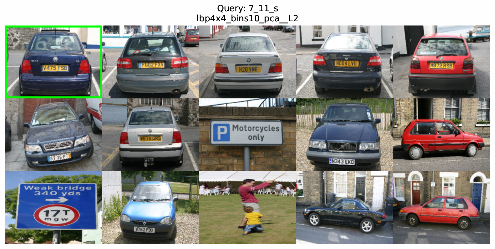

# CV Visual Search Engine & Classifier




---

## 📌 Project Overview

This project implements a complete **Content-Based Image Retrieval (CBIR)** and **Image Classification** system using the **MSRC Object Category Image Database v2** (591 images across 20 object classes).

The goal is to investigate which **computer vision descriptors** best capture visual similarity in a dataset with **high inter-class ambiguity** (e.g., *grass* vs. *cows on grass*). The system evaluates:

- Global Color Histograms  
- Spatial Grid-based Color & Texture  
- Texture Descriptors (LBP, EOH)  
- Local Features with **SIFT + Bag of Visual Words (BoVW)**  

### 🔑 Key Result

> A **Spatial Grid-based Local Binary Pattern (LBP)** descriptor  
> (**4×4 grid, P=10**, reduced using **PCA**) outperformed more complex BoVW models:
>
> - **mAP:** `0.158`
> - **SVM Classification Accuracy:** `68.07%`

---

## 🛠️ Implemented Descriptors

| Descriptor | Visualization |
|-----------|---------------|
| Global Color Histogram |  |
| Edge Orientation Histogram (EOH) |  |
| Local Binary Patterns (LBP) |  |
| SIFT + BoVW |  |
| Spatial Grid (Color + Texture) |  |

---

## 📁 Repository Structure
```
CV-Visual-Search-Engine/
│
├── data/
│   └── MSRC_ObjCategImageDatabase_v2/
│       ├── Images/                    # Place all .bmp images here
│       └── descriptors/               # Generated .mat files appear here
│
├── src/
│   ├── config.py                      # ⚠️ MAIN FILE TO CONFIGURE
│   └── ...                            # Other Python scripts
│
├── assets/
│   ├── search.png
│   └── descriptor_visuals/
│       ├── EOH.png
│       ├── hist.png
│       ├── lbp.png
│       ├── SIFT.png
│       └── sp_grid.png
│
├── report_visuals/                    # Auto-generated results (PR curves, PDFs)
└── requirements.txt
```

---

## ⚙️ Configuration (IMPORTANT)

All paths are centrally managed via:

**`src/config.py`**

The project **automatically detects its root directory**, so it works regardless of where the repository is cloned.

---

## 🚀 Usage Guide

### 1️⃣ (Optional) Bag of Visual Words (BoVW Pipeline)

If you want to use SIFT + BoVW, you must generate the codebook first:
```bash
python src/bovw_step1_extract_all_sift.py
python src/bovw_step2_create_codebook.py
```

### 2️⃣ Feature Extraction

Generate descriptors for the dataset.

Edit `src/config.py` to select the descriptor mode (e.g., `lbp`, `global`, `grid_col_tex`):
```bash
python src/cvpr_computedescriptors.py
```

### 3️⃣ PCA & Retrieval Evaluation

Reduce dimensionality and compute retrieval metrics:
```bash
python src/compute_pca.py
python src/compute_evaluation_stats.py
```

**Outputs:**
- PCA scree plots
- Precision–Recall curves
- Mean Average Precision (mAP)

### 4️⃣ Automated Batch Experiments

Reproduce all experiments used in the report:
```bash
python src/run_experiment_batch.py
```

This script sequentially runs:
- Descriptor extraction
- PCA
- Retrieval evaluation

### 5️⃣ SVM Classification

Train an SVM using the best-performing descriptor (LBP + PCA):
```bash
python src/SVM.py
```

**Outputs:**
- Confusion matrix
- Per-class accuracy
- Overall accuracy (68.07%)

### 6️⃣ Visual Search Demo

Run an interactive visual search query:
```bash
python src/cvpr_visualsearch.py
```

---

## 📊 Results Summary

| Descriptor Strategy | Best Metric | mAP | P@15 |
|---------------------|-------------|-----|------|
| Spatial LBP (4×4, P=10, PCA) | L2 | 0.158 | 0.397 |
| Spatial LBP + Color (PCA) | Mahalanobis | 0.142 | 0.370 |
| Spatial Grid (Color + Texture) | L3 | 0.120 | 0.326 |
| Global Color Histogram | L1 | 0.096 | 0.267 |
| SIFT + BoVW (k=500, PCA) | L2 | 0.083 | 0.254 |

---

## 📦 Requirements

Install dependencies with:
```bash
pip install -r requirements.txt
```

**requirements.txt**
```
numpy
scipy
opencv-python
matplotlib
scikit-learn
scikit-image
pandas
seaborn
joblib
```

---

## 📝 License

This project is available under the MIT License.

## 🤝 Contributing

Contributions, issues, and feature requests are welcome!

## 📧 Contact

For questions or feedback, please open an issue in this repository.
